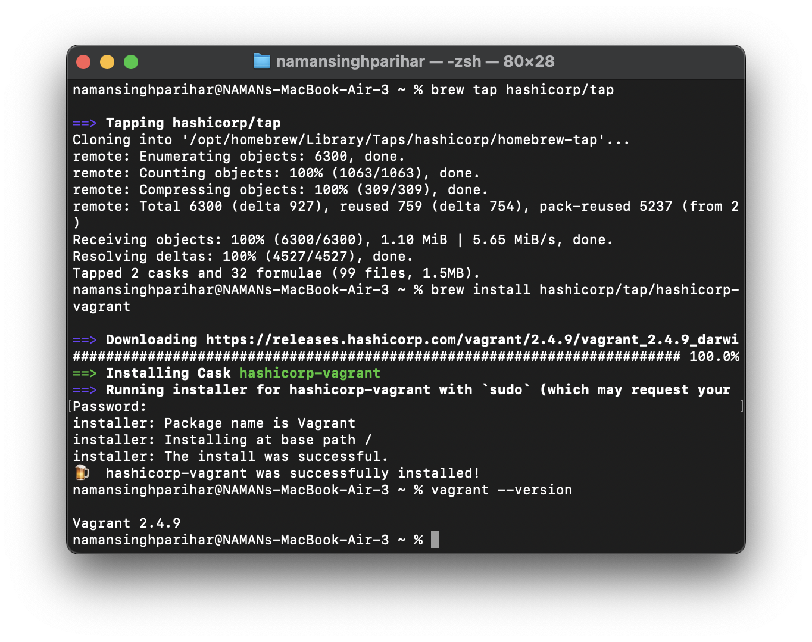
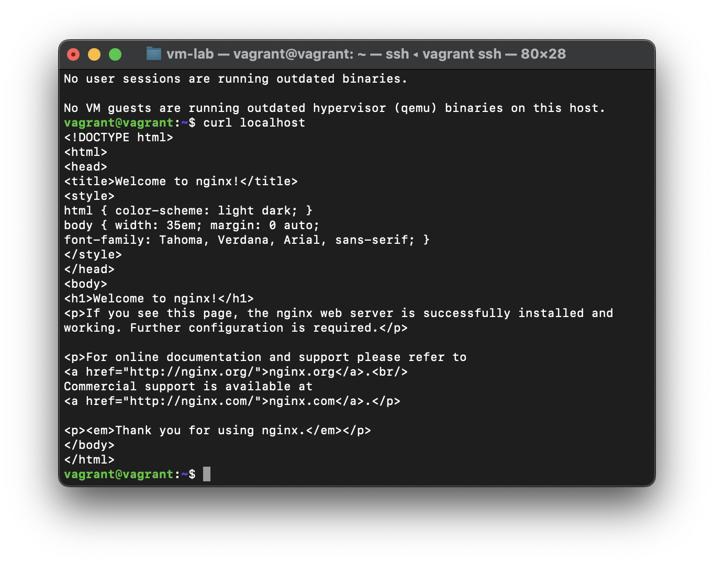
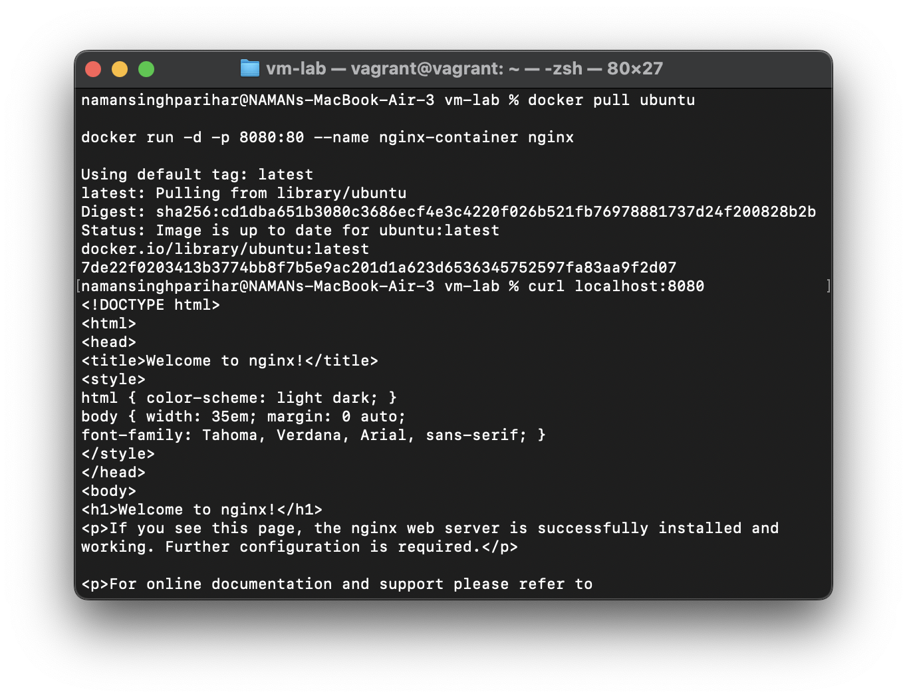
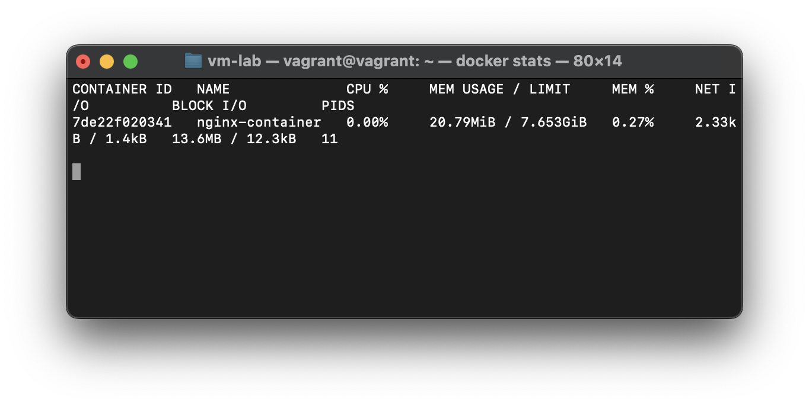

# Experiment 1: Comparison of Virtual Machines (VMs) and Containers using Ubuntu and Nginx

## Objective
- Install Vagrant and run nginx on VM
- Containerize Nginx on docker
- Compare image size  

## Procedure

### Step 1: Installing Vagrant
Installation of Vagrant, using homebrew for mac.

### Step 2: Add Vagrant box image of ubuntu
Initializing ubuntu image over the Vagrant box.

### Step 3: VM Creation
VM created successfully, "vagrant up --provider=utm" command directly makes VM of the image on UTM

### Step 4: Install and verify Nginx
Insatllation of nginx.

### Step 5: Check Vagrant stats

### Step 6: Halt and Destroy VM

### Step 7: Pull Ubuntu Image over Docker and run Nginx
Using pull command we will pull ubuntu and run Nginx over it.

### Step 8: Check stats and compare with Vagrant

## Conclusion
This experiment shows a clear difference between Vagrant virtual machines and Docker containers when running Nginx.

Vagrant (Ubuntu VM) runs a full operating system, so it uses more disk space and system resources.

Docker (Ubuntu container) shares the host kernel and only runs the required processes, resulting in very low CPU and memory usage.

Because of this architectural difference, the system statistics varied significantly.
Conclusion: Docker is lightweight and resource-efficient for applications like Nginx, while Vagrant is better for full OS-level testing and isolation.

