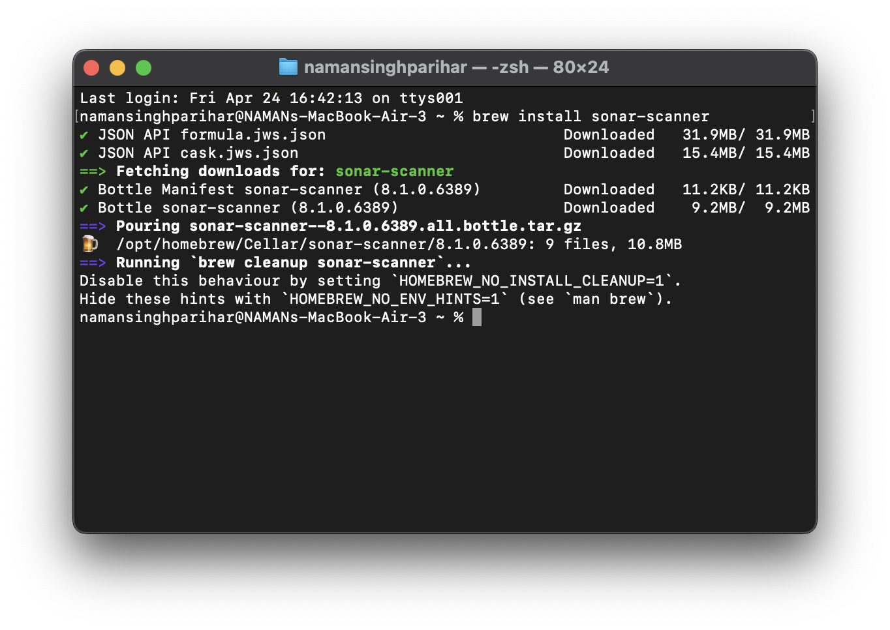
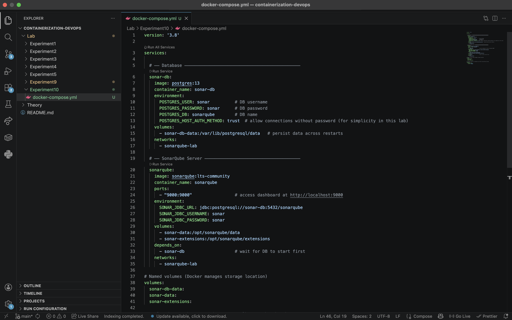
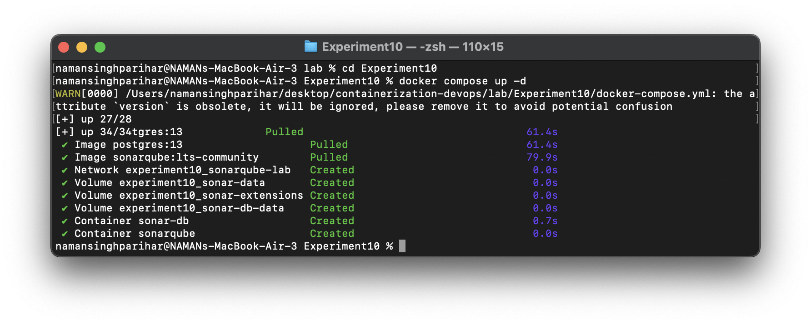
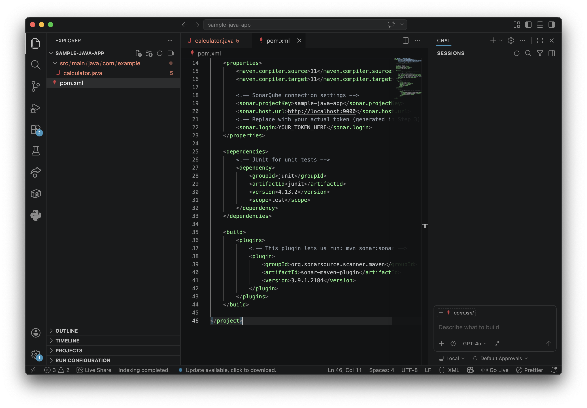
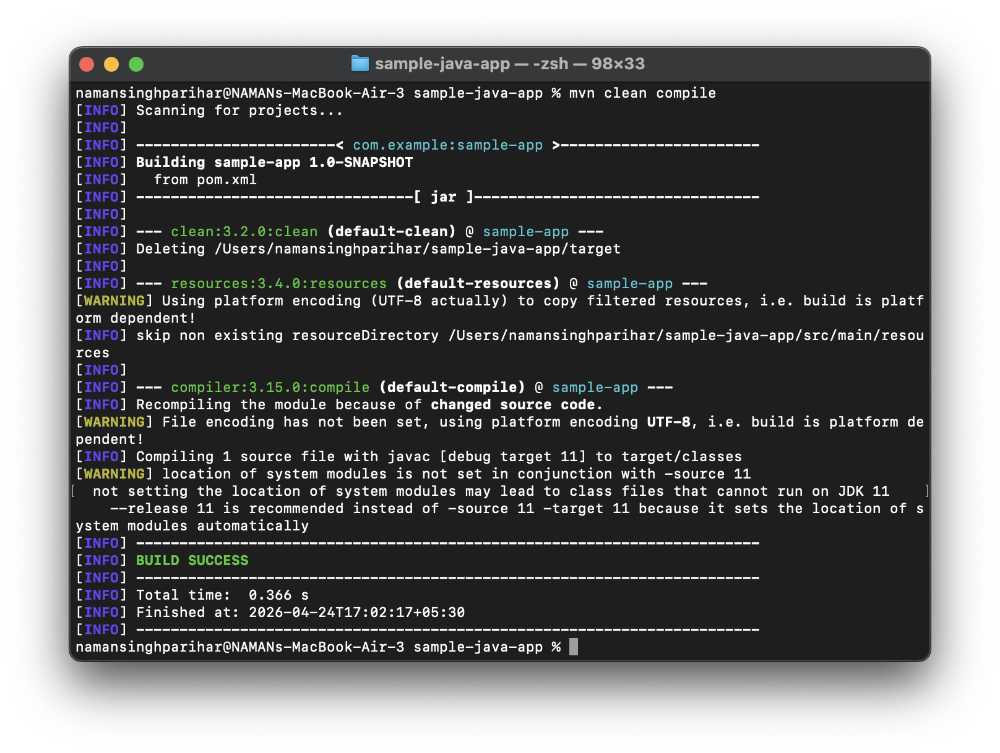
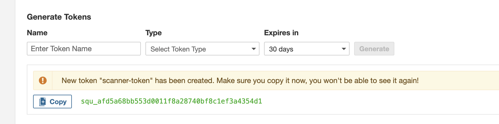
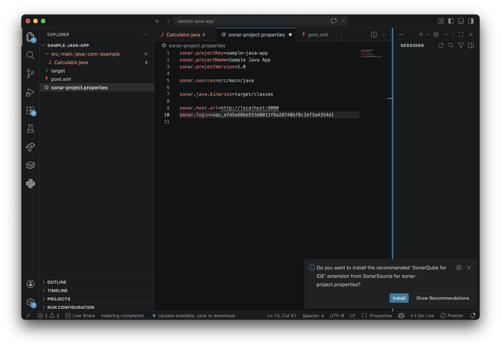
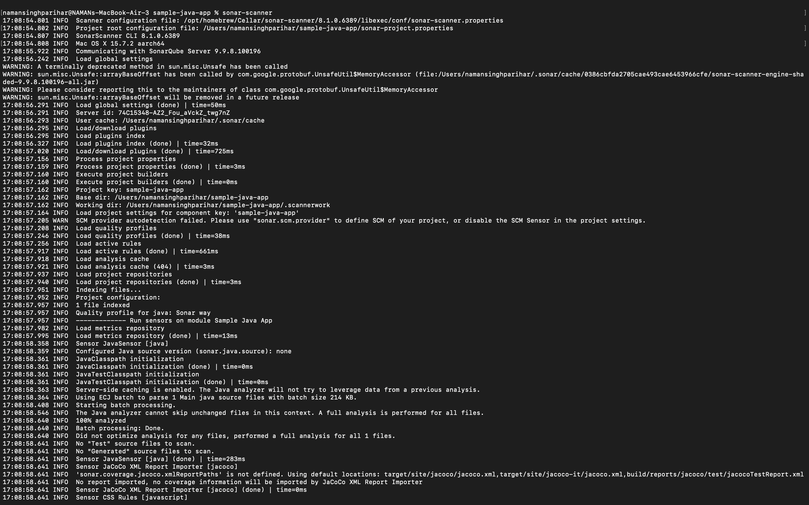
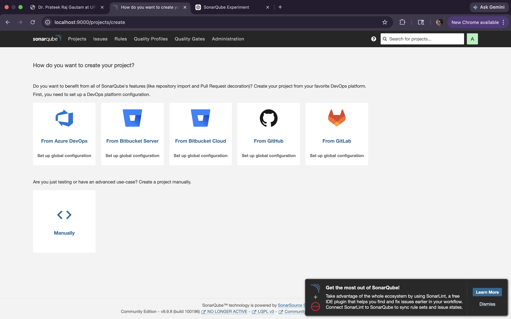
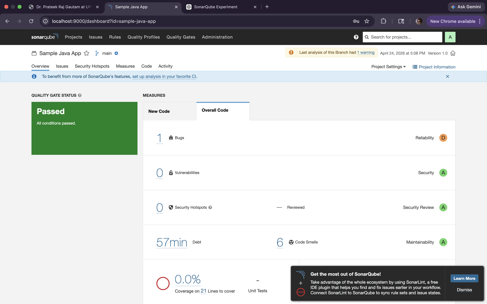

# Experiment 10: SonarQube — Static Code Analysis

## SonarQube — Static Code Analysis

**SonarQube** is an open-source platform used for **static code analysis**, which means analyzing source code without executing it.

- Helps detect **bugs, vulnerabilities, and code smells**  
- Improves **code quality and maintainability**  
- Supports multiple languages (Java, Python, JavaScript, etc.)  
- Integrates with CI/CD tools for continuous inspection  

### Key Features

- **Bug Detection:** Finds errors that may cause failures  
- **Security Analysis:** Identifies vulnerabilities in code  
- **Code Smells:** Highlights poor coding practices  
- **Quality Gates:** Sets conditions to pass/fail code quality  

### Why Use SonarQube?

- Ensures **clean and secure code**  
- Maintains **coding standards**  
- Provides a **visual dashboard** for results  
- Useful in **team-based development and DevOps pipelines**  

## Step 1: Installing SonarQube

Installed SonarQube using Homebrew (macOS):

- Simple and quick installation using package manager  
- Automatically handles dependencies  
- Easy to manage and update  

### 📸 Illustration

## Step 2: Start the SonarQube Server

The SonarQube server is started using Docker Compose.

- Runs SonarQube along with a PostgreSQL database  
- Ensures all required services start together  
- Simplifies setup and management  

### 📸 Illustration

## Step 3: Create a Sample Java App with Code Issues

### a) Sample App with Issues
- Create a simple Java class with intentional bugs  
- Includes vulnerabilities and code smells  
- Helps demonstrate SonarQube analysis  

### b) Create `pom.xml` (Maven Build File)
- Defines project dependencies and build configuration  
- Required for building and analyzing the project  
- Used by SonarQube during scanning  

## Step 4: Generate Authentication Token

The SonarQube scanner requires a token to authenticate with the server.

- Generated manually from the SonarQube web UI  
- Used for secure communication between scanner and server  
- Acts as an alternative to username/password  

### 📸 Illustration

## Step 5: Run the Scanner

The Sonar Scanner is used to analyze the project code.

- Uses Sonar Scanner CLI (language independent)  
- Requires a configuration file in the project root  
- Sends analysis results to the SonarQube server  

### Configuration File: `sonar-project.properties`
- Contains project details and settings  
- Helps the scanner understand what to analyze  

### 📸 Illustration

## Step 6: View Results in the Dashboard

After the scan is complete, results can be viewed in the SonarQube dashboard.

- Displays bugs, vulnerabilities, and code smells  
- Provides detailed code analysis reports  
- Helps track code quality and improvements  

### 📸 Illustration

