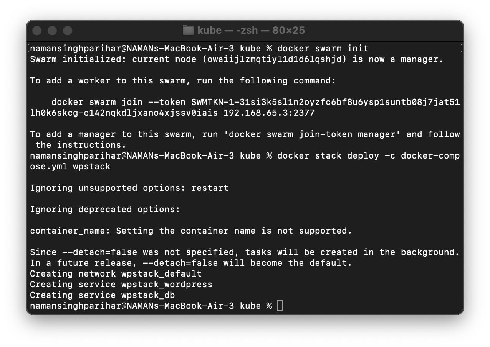
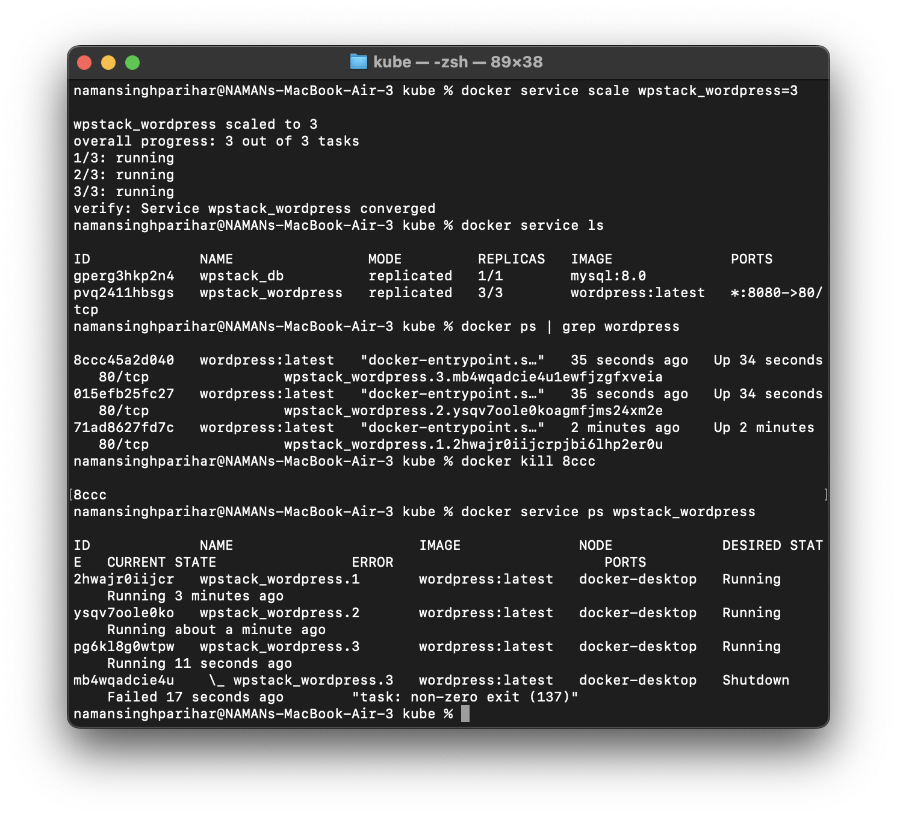
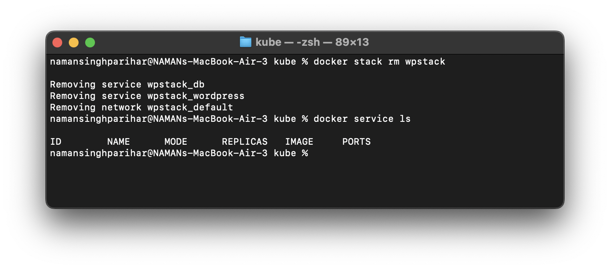

#  Experiment 11: Orchestration using Docker Compose & Docker Swarm 

### Task 1: Initialize Swarm & Deploy Stack
- Initialized Docker Swarm mode  
- Deployed application stack using a compose file  
- Services started as swarm-managed containers  

### Task 2: Scale WordPress & Test Self-Healing
- Scaled WordPress service to multiple replicas  
- Verified all replicas were running  
- Manually removed one container  
- Swarm automatically recreated it (**self-healing**)  

### Task 3: Remove Stack & Verify
- Removed the deployed stack  
- All services and containers were stopped  
- Verified clean environment  

