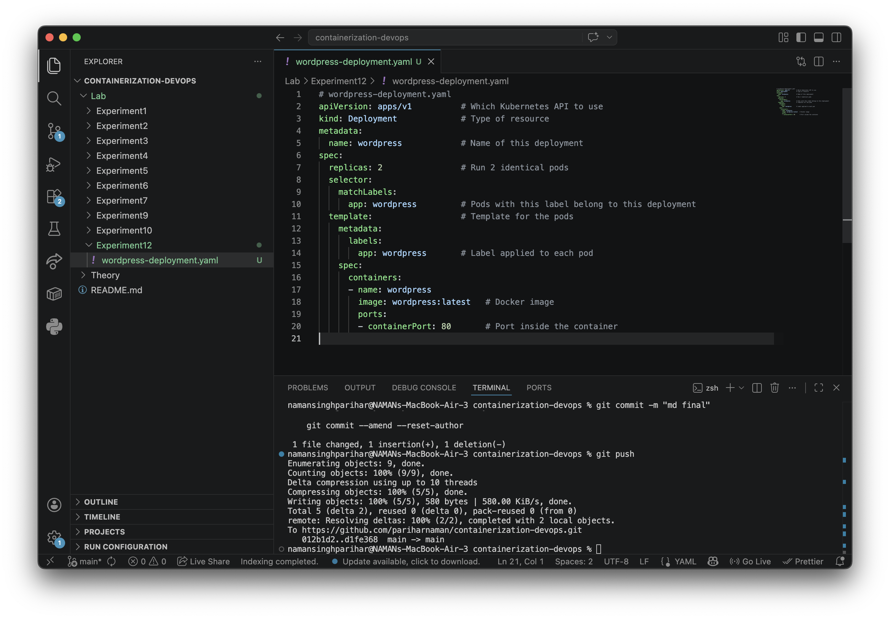
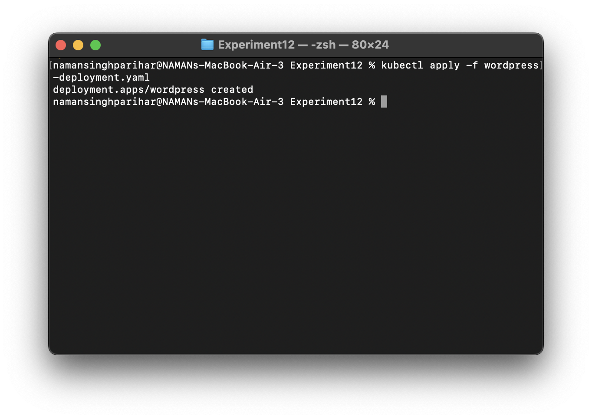
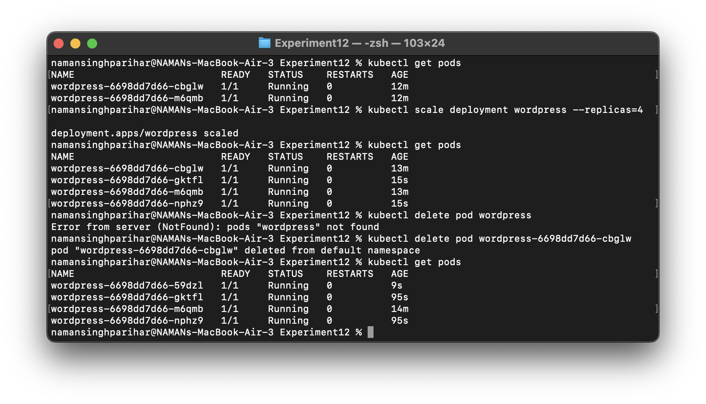

# Experiment 12: Study and Analyse Container Orchestration using Kubernetes

## Task 1: Create a Deployment

### Step 1: Create `wordpress-deployment.yaml`
- Defines Kubernetes deployment configuration  
- Specifies pods, replicas, and container details  

### Step 2: Apply the Deployment
- Creates resources in the Kubernetes cluster  
- Starts the defined application pods  

## Task 2: Pod Scaling and Self-Healing

- Initially deployed with **2 pods**  
- Scaled the deployment to **4 pods** to handle increased load  
- Verified that all 4 pods were running successfully  
- Manually deleted one pod to test reliability  
- Kubernetes automatically recreated the deleted pod (**self-healing**)  
- Ensures high availability and maintains desired state  

### 📸 Illustration

