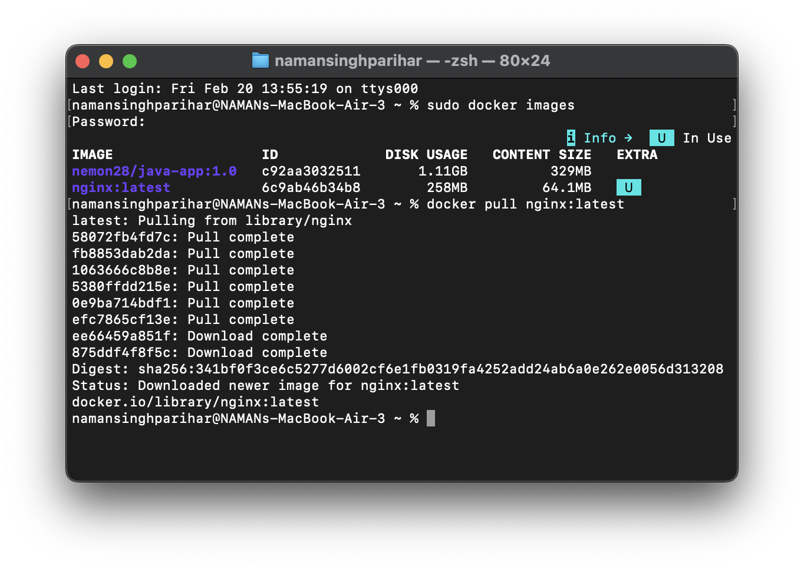
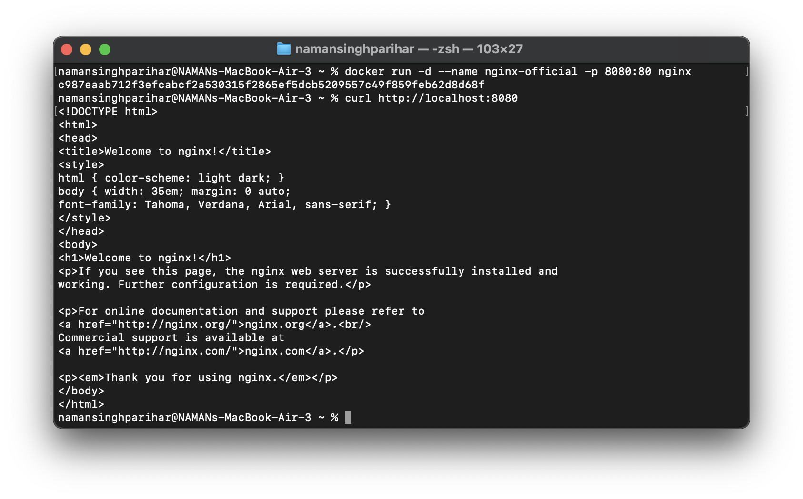
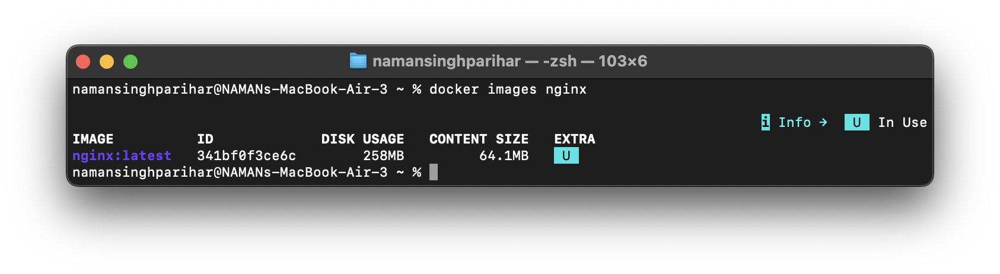
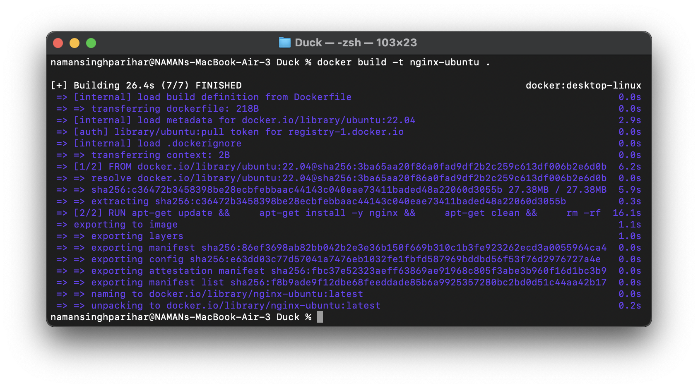
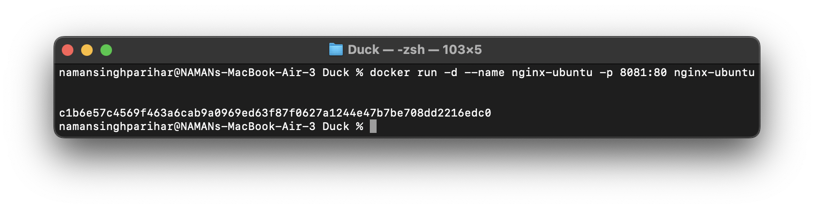

# Experiment 3: Comparison of Nginx Servers (Latest, Ubuntu, Alpine)

## Objective
- Pull Nginx Docker image  
- Build custom Docker images  
- Run containers from different base images  
- Compare image sizes and efficiency  

---

## Procedure

### Step 1: Pull Nginx Latest Image
The official Nginx latest image was pulled from Docker Hub to the local system.

```bash
docker pull nginx:latest
```



---

### Step 2: Run Nginx Server (Latest)
A container was created and executed from the nginx:latest image with port mapping.

```bash
docker run -d -p 8080:80 --name nginx-latest nginx:latest
```



---

### Step 3: Check Image Statistics for Comparison
The image details were checked to observe the size and other properties for comparison.

```bash
docker images nginx
```



---

### Step 4: Build Dockerfile (Ubuntu-Based Image)
A Dockerfile was created using Ubuntu as the base image and Nginx was installed.

```dockerfile
FROM ubuntu:latest
RUN apt update && apt install -y nginx
CMD ["nginx", "-g", "daemon off;"]
```

The image was built using:

```bash
docker build -t nginx-ubuntu .
```



---

### Step 5: Run Ubuntu-Based Nginx Container
The container was executed from the newly built nginx-ubuntu image.

```bash
docker run -d -p 8081:80 --name nginx-ubuntu-container nginx-ubuntu
```



---

### Step 6: Observe Image Details (nginx-ubuntu)
The image size and details were observed for comparison.

```bash
docker images nginx-ubuntu
```


---

### Step 7: Build Dockerfile (Alpine-Based Image)
A new Dockerfile was created using Alpine as the base image and Nginx was installed.

```dockerfile
FROM alpine:latest
RUN apk add --no-cache nginx
CMD ["nginx", "-g", "daemon off;"]
```

The image was built using:

```bash
docker build -t nginx-alpine .
```


---

### Step 8: Run Alpine-Based Nginx Container
The container was executed from the nginx-alpine image.

```bash
docker run -d -p 8082:80 --name nginx-alpine-container nginx-alpine
```


---

### Step 9: Observe Image Details (nginx-alpine)
The image size and details were checked for final comparison.

```bash
docker images nginx-alpine
```


---

## Observation

- The nginx:latest image had moderate size.
- The nginx-ubuntu image was larger because it includes the full Ubuntu base OS.
- The nginx-alpine image was the smallest and most lightweight.

---

## Result
Different Nginx Docker images were successfully built, executed, and compared based on their base image and size.

---

## Conclusion
This experiment demonstrated the impact of base images on Docker image size and efficiency.  
The Alpine-based image was the most lightweight and suitable for optimized deployments, while Ubuntu-based images were comparatively larger due to additional system packages.
