#  Experiment 4: Docker Essentials  


##  Task 1: Single-Stage Build of Flask Application


---

##  Objective  
To containerize a Python Flask application using Docker with a **single-stage build**, and perform image and container management operations.

---

##  Technologies Used  
- Python 3  
- Flask  
- Docker  

---

##  Files Created  

1. **app.py** – Flask application  
2. **requirements.txt** – Dependencies  
3. **Dockerfile** – Instructions to build Docker image  
4. **.dockerignore** – Excluded unnecessary files  

---

##  Steps Performed  

### 1: Created Flask Application (app.py)  
A simple Flask app was created to display a message on the browser.

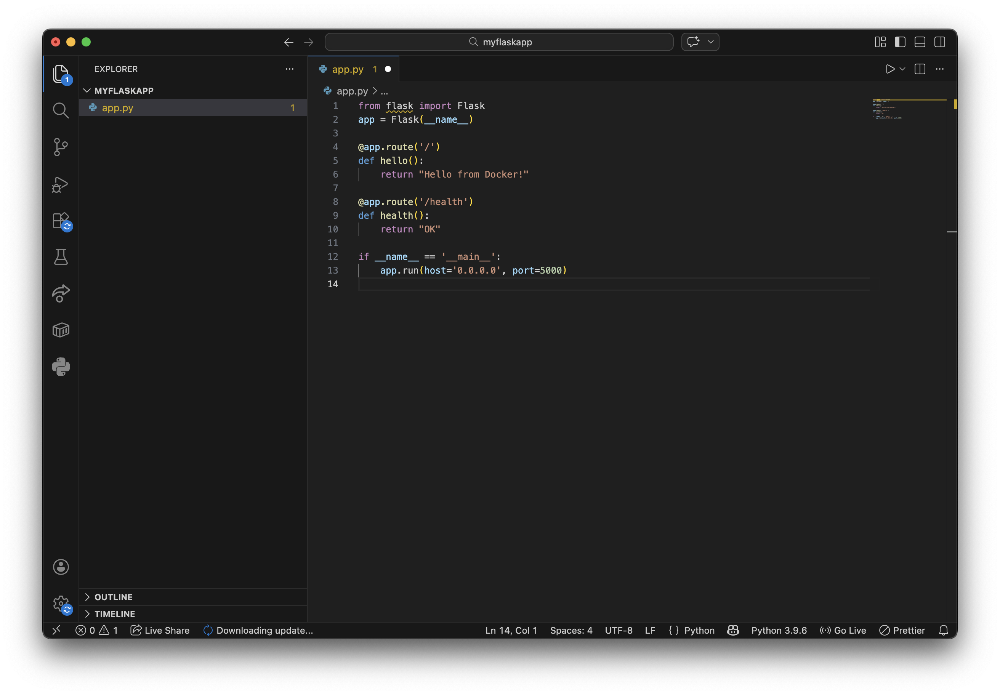
---

### 2. Created Dockerfile  
Added Flask dependency required to run the application.
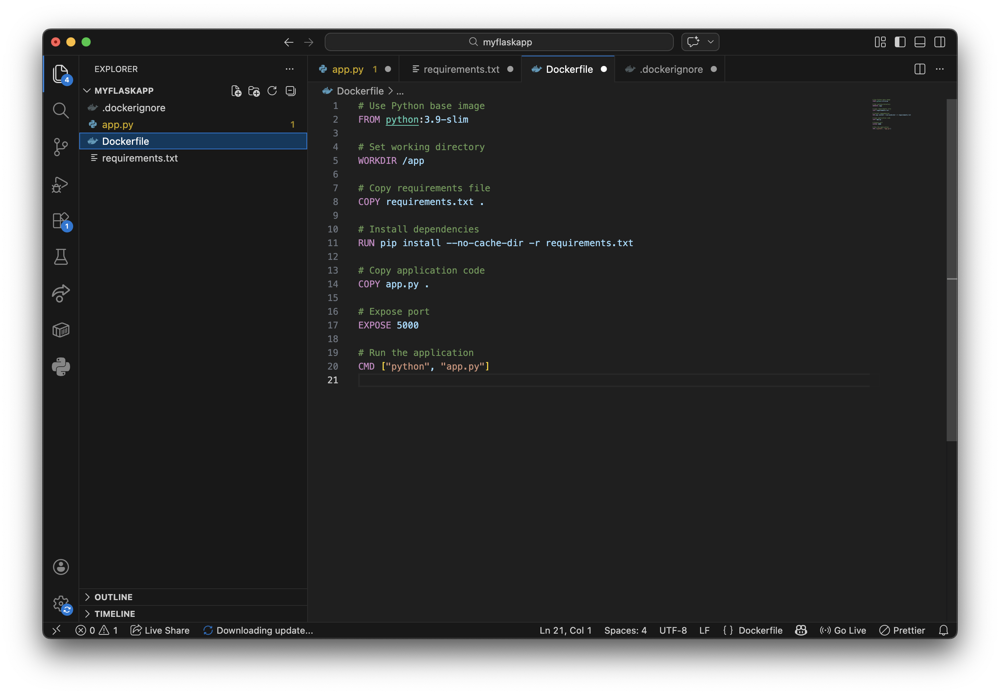

---


### 3. Created .dockerignore  
Ignored unnecessary files such as cache, environment files, and Git data to reduce image size.

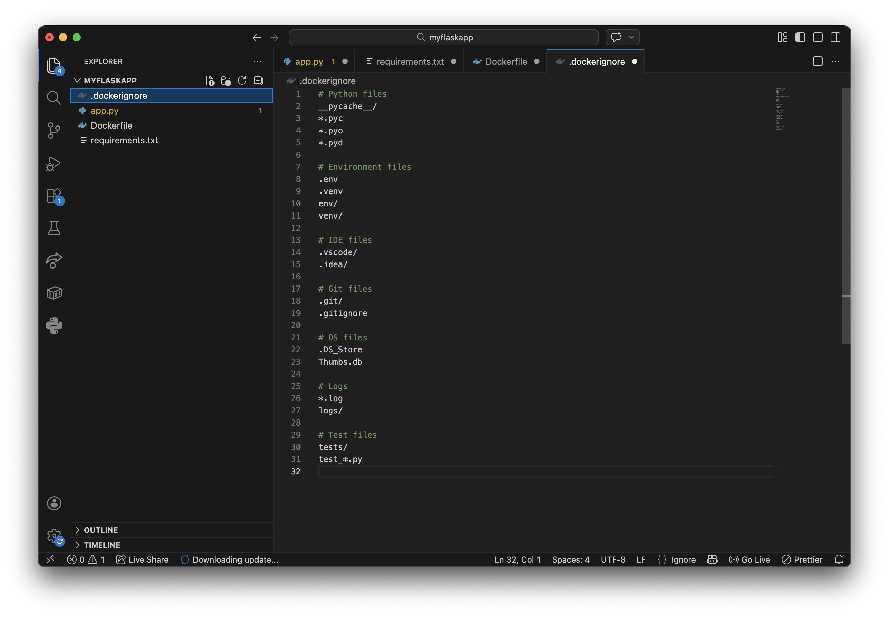

---

### 4. Built Docker Image  
```bash
docker build -t my-flask-app:latest .
```
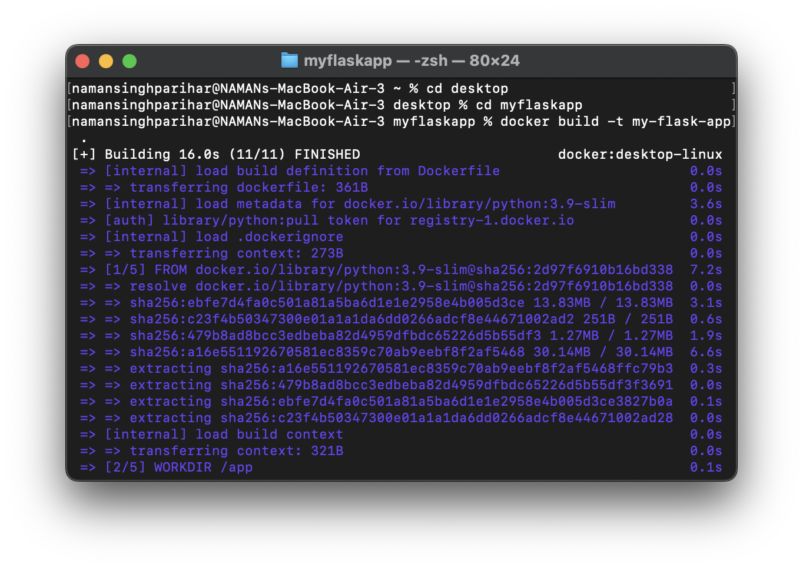

### 5. Tagged Docker Image

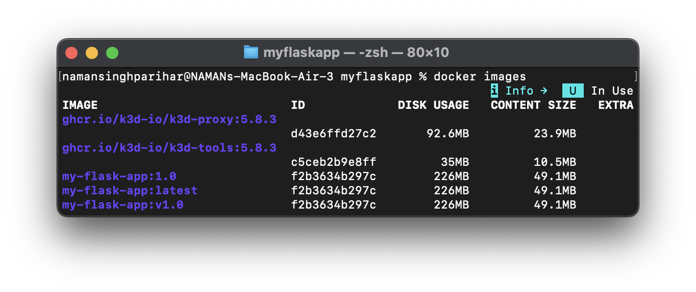

### 6. Running Container over local host

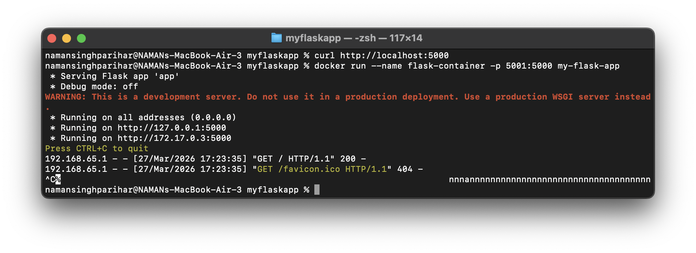

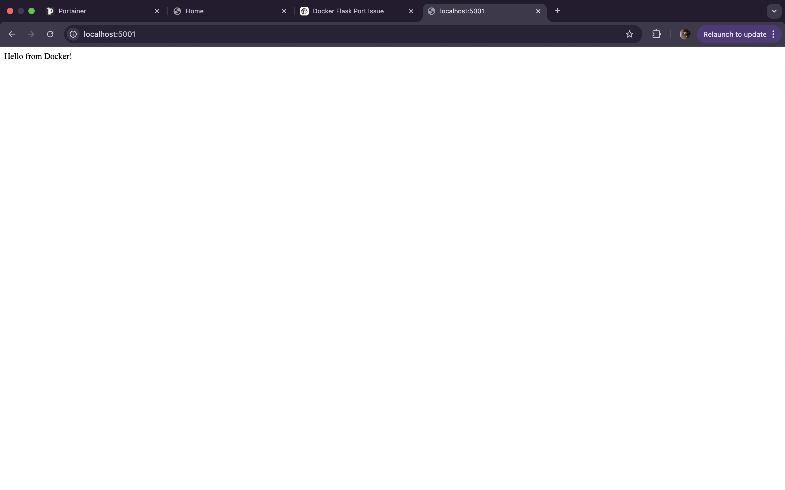

### 7. Removing Flask Container

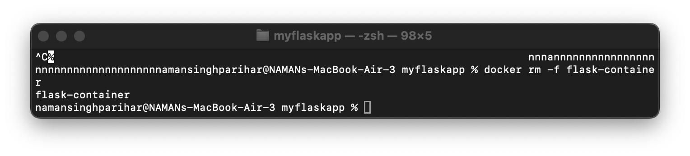


## Task 2: Multi-stage Build

##  Steps Performed 

### 1. Creating Docker.multistage file

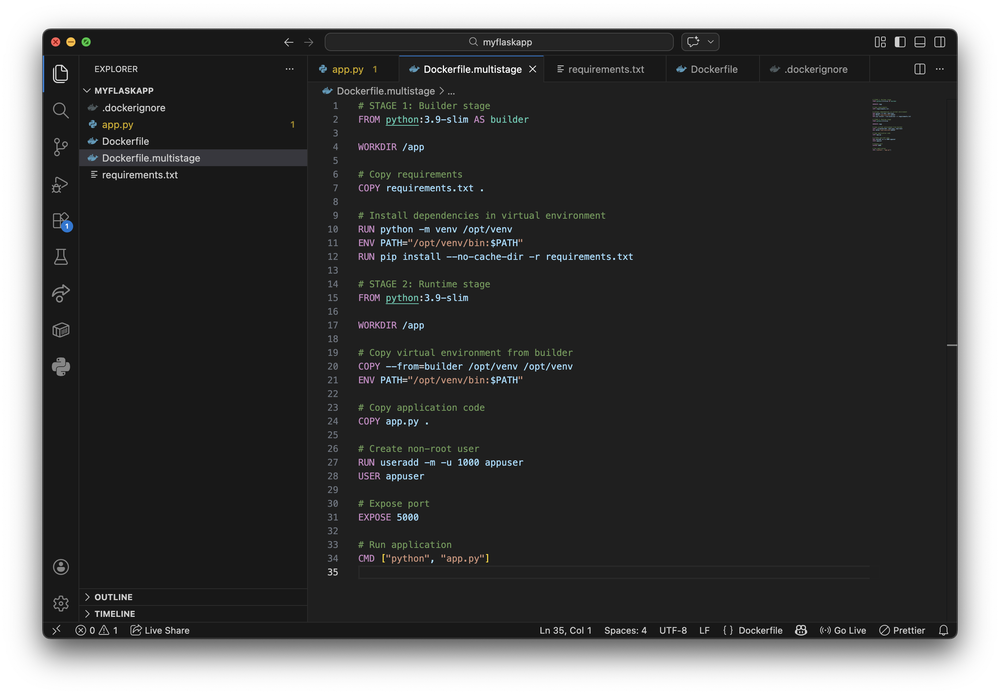

### 2. Performing Multi-stage Build

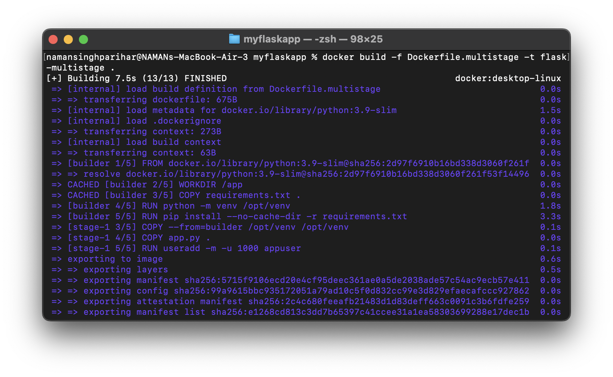

### 3. Comparing Build sizes

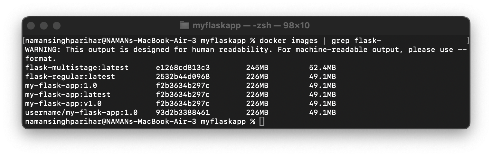

### 4. Pushing tagged images to Docker Hub

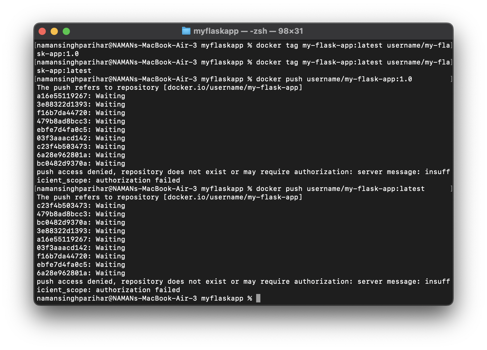

### 5. Pull and run docker image (my-flask-app)

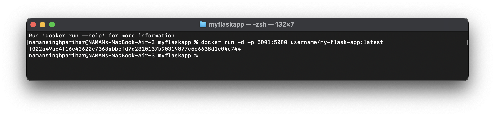

Localhost:5001

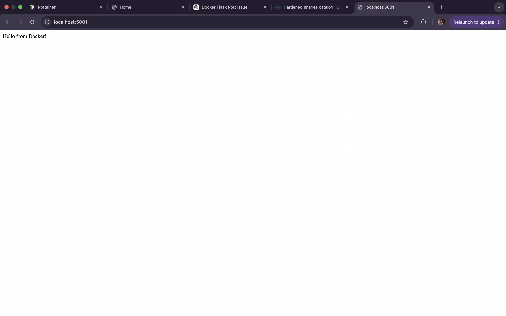


## Task 3: Node.js 

## Steps Performed

### 1. Create Dockerfile, App.js ,and json package file 

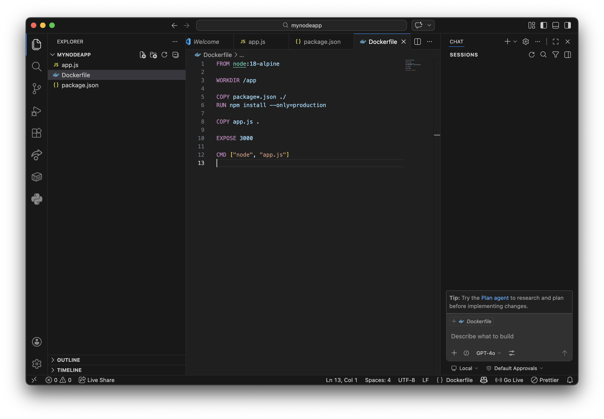

### 2. Build docker image and Run docker container 

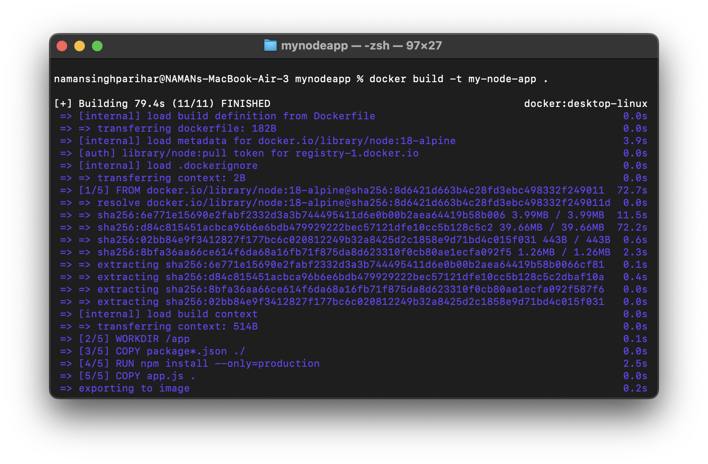

### 3. Check localhost

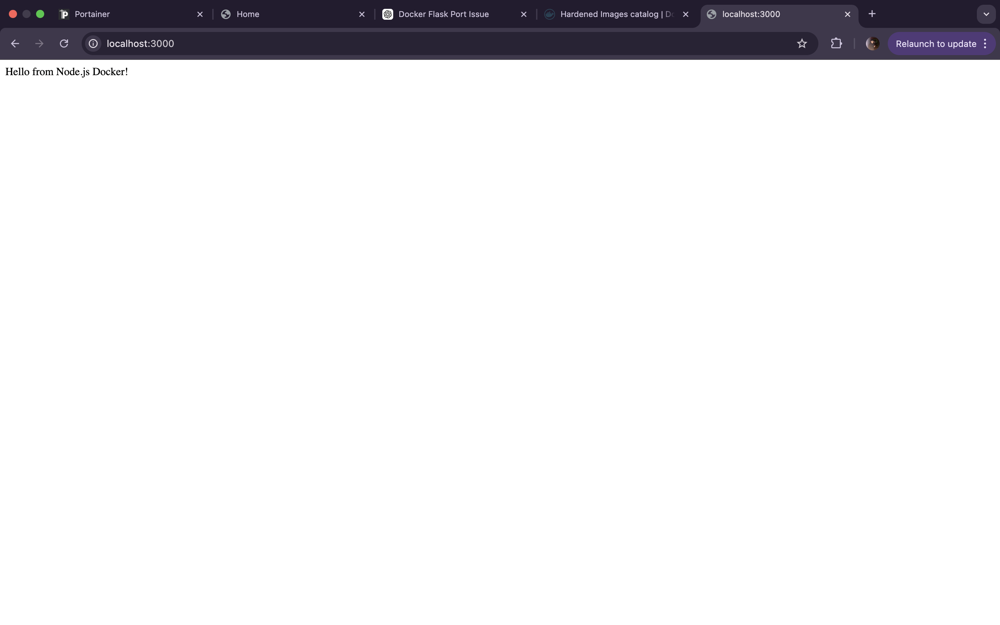
