# Experiment 7: CI/CD using Jenkins, GitHub and Docker Hub

## Part A: GitHub Repository Setup (Source Code + Build Definition)

### 1: `app.py`
- Contains the main application code  
- Defines the core functionality of the project  

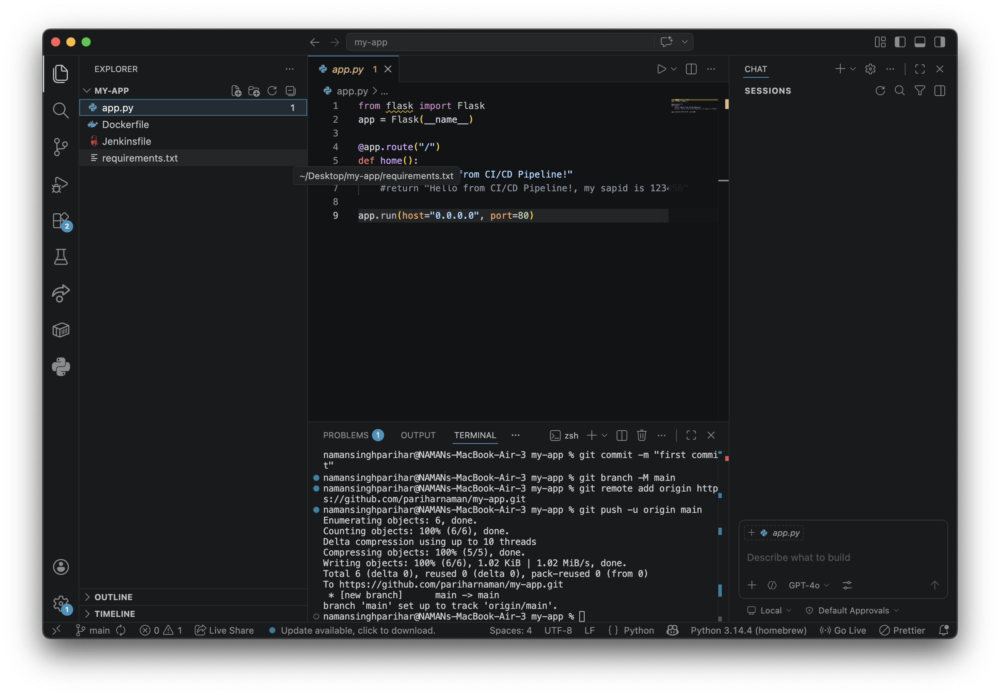

### 2: `Dockerfile`
- Defines how the application image is built  
- Includes dependencies and runtime configuration  

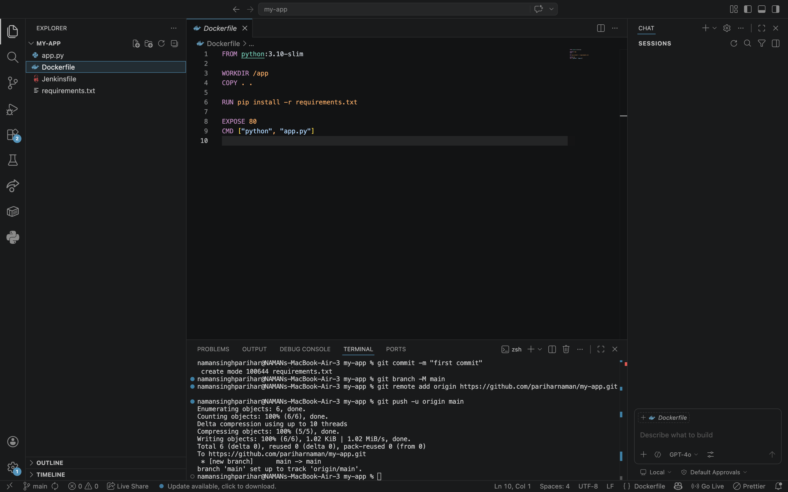

### 3: `Jenkinsfile`
- Defines CI/CD pipeline stages  
- Automates build, test, and deployment process  

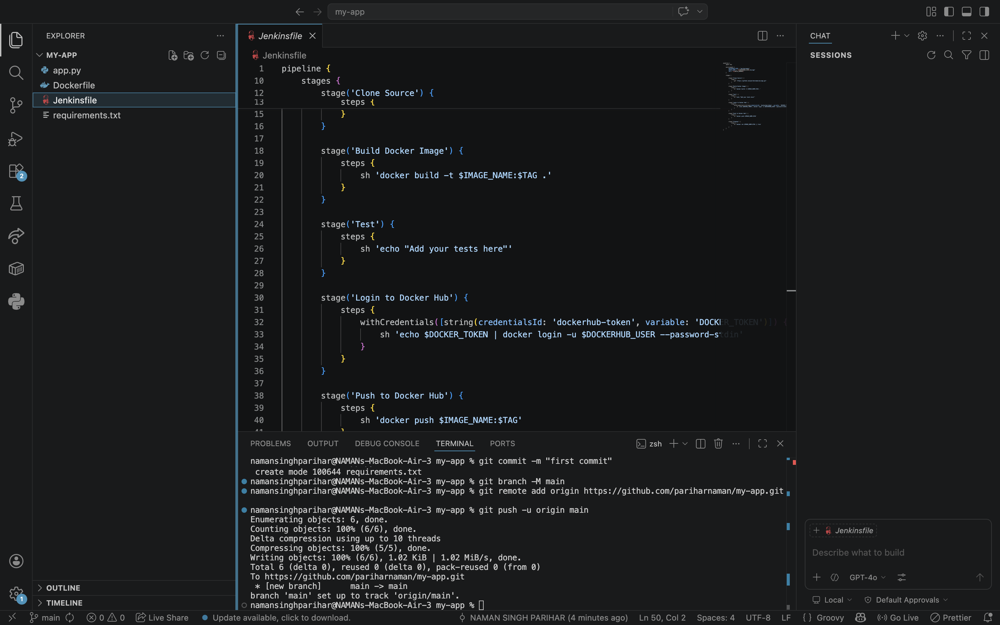

## Part B: Jenkins Setup using Docker (Persistent Configuration)

### 1: Create Docker Compose File
- Defines Jenkins service with persistent storage  
- Ensures data is retained across restarts  

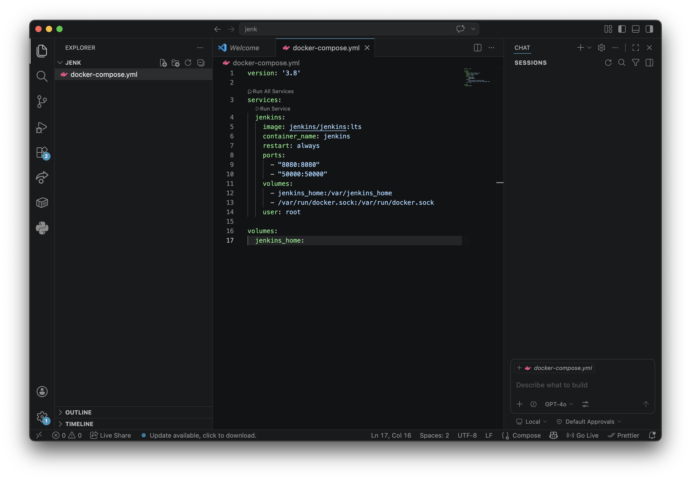

### 2: Start Jenkins
- Launch Jenkins container using Docker Compose  
- Initializes the CI/CD environment  

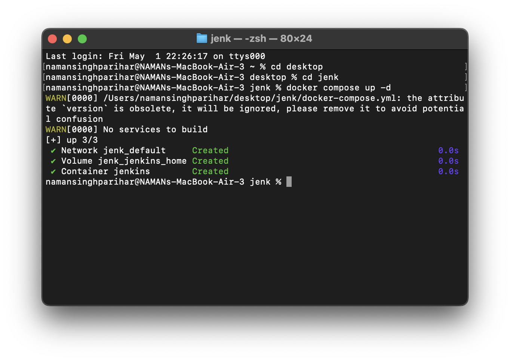

### 3: Unlock Jenkins
- Access Jenkins via browser  
- Enter initial admin password to unlock  

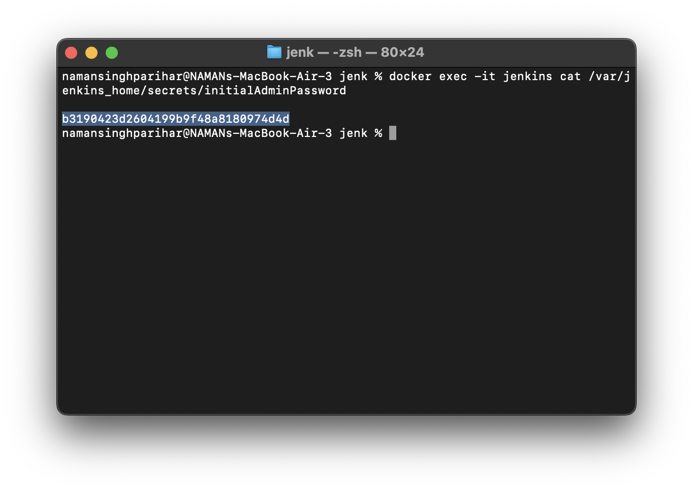

### 4: Jenkins on localhost
- Created first user 
- Jenkins console accessibility
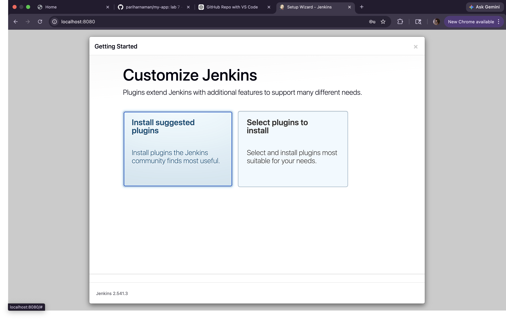

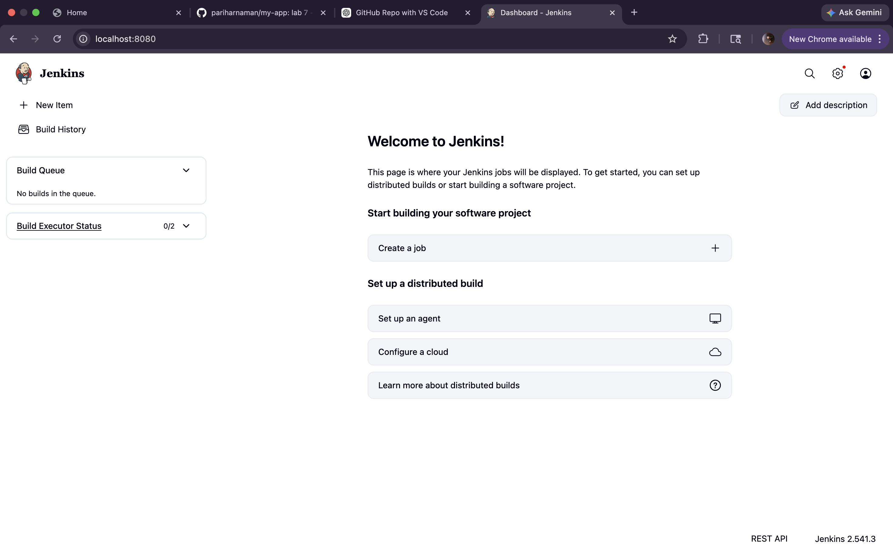
## Part C: Jenkins Configuration

### 1: Add Docker Hub Credentials
- Configure credentials for Docker Hub access  
- Enables pushing images from pipeline  

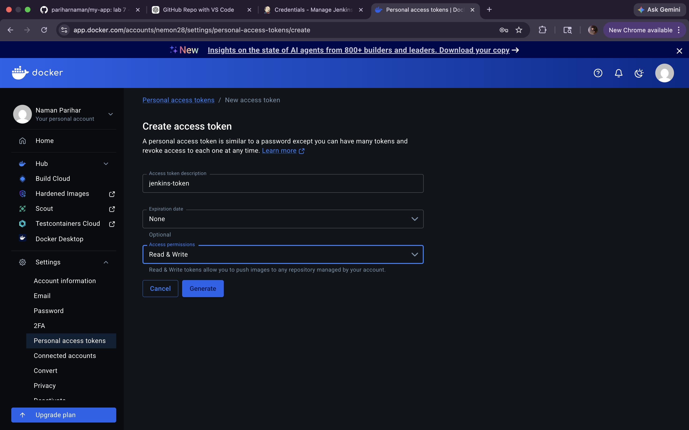

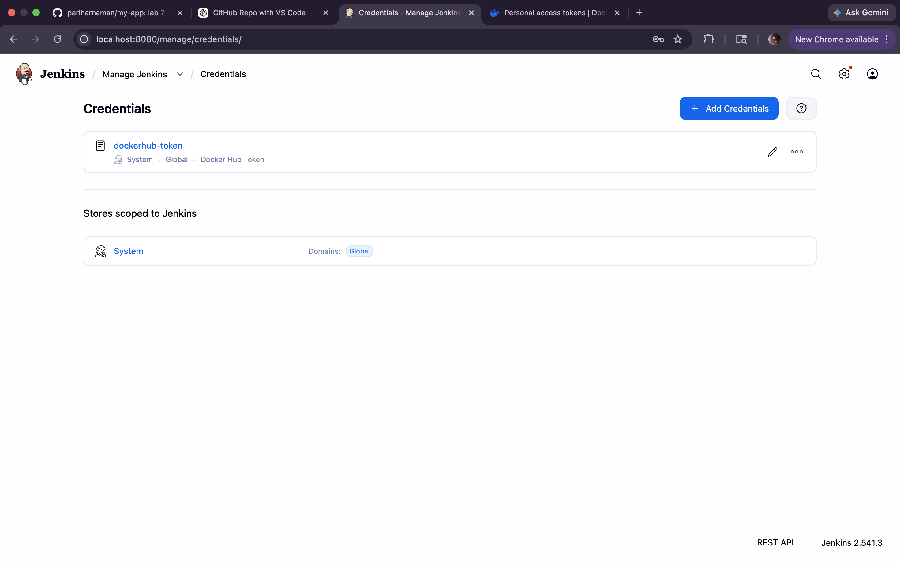

### 2: Create Pipeline Job
- Set up a Jenkins pipeline job  
- Connects repository and automates build process  

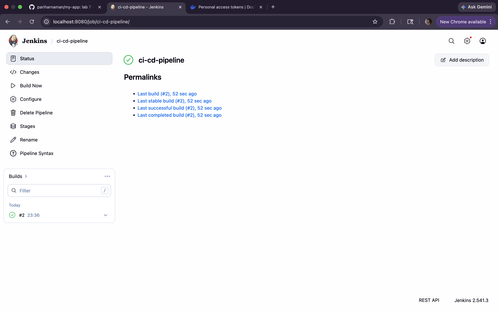

## Part D: GitHub Webhook Integration

### 1: Configure Webhook
- Connect GitHub repository with Jenkins  
- Triggers pipeline on code changes  

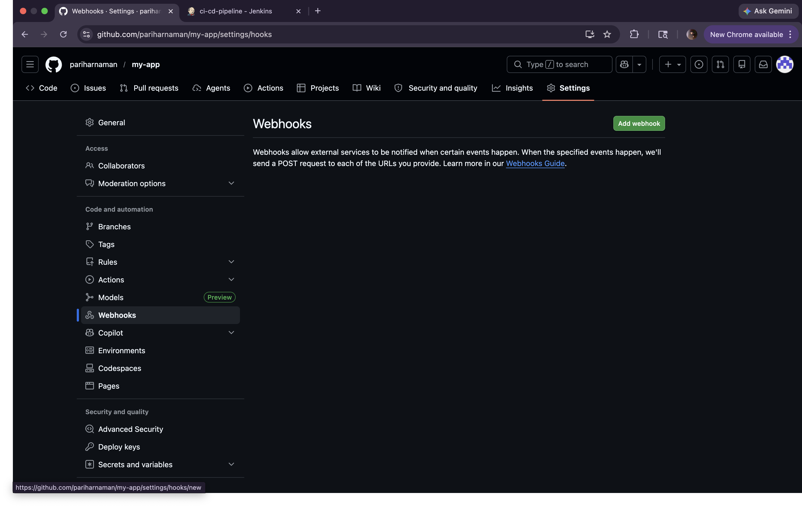

### 2: Setup Ngrok for Communication
- Exposes local Jenkins server to the internet  
- Enables GitHub to send webhook events  

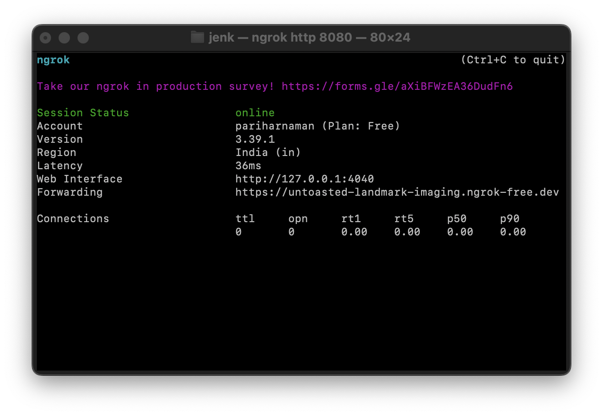

### 3: Test Your CI/CD Pipeline
- Push changes to trigger the pipeline  
- Verify automated build and deployment  

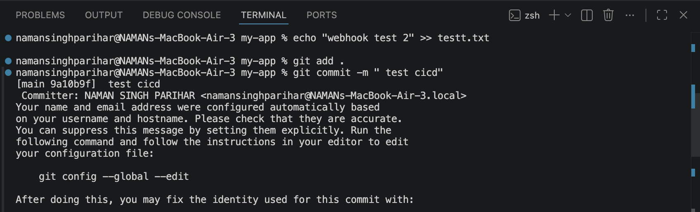

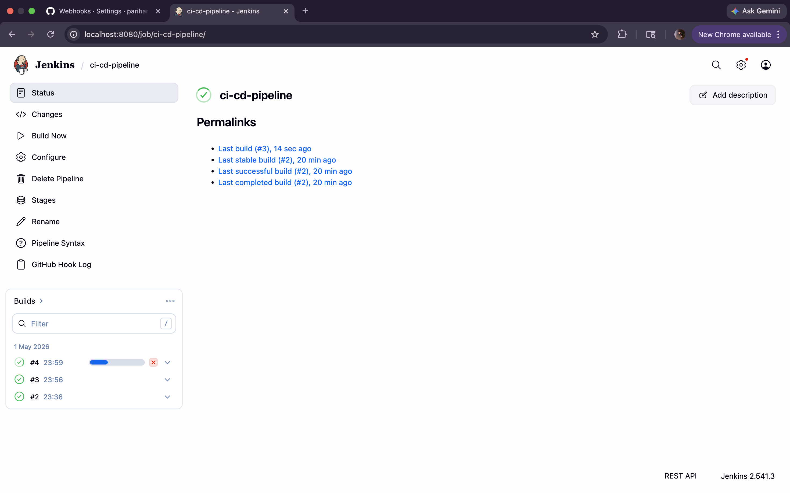