# Experiment 9: Ansible

## Step 1: Ansible Installation (macOS using Homebrew)

### Installation

- Install Ansible using Homebrew:
```bash
brew install ansible
```
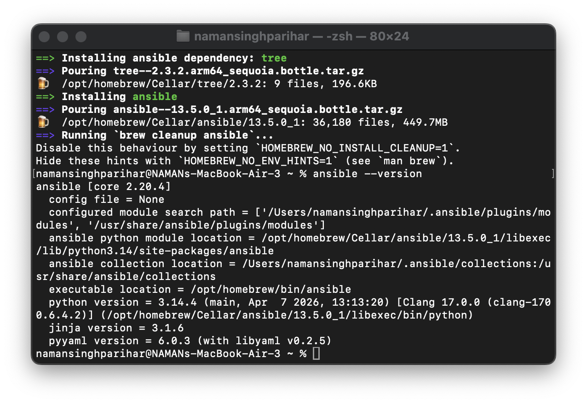

## Step 2: Post-Installation Check

Verify that Ansible is installed correctly:

```bash
ansible --version
```
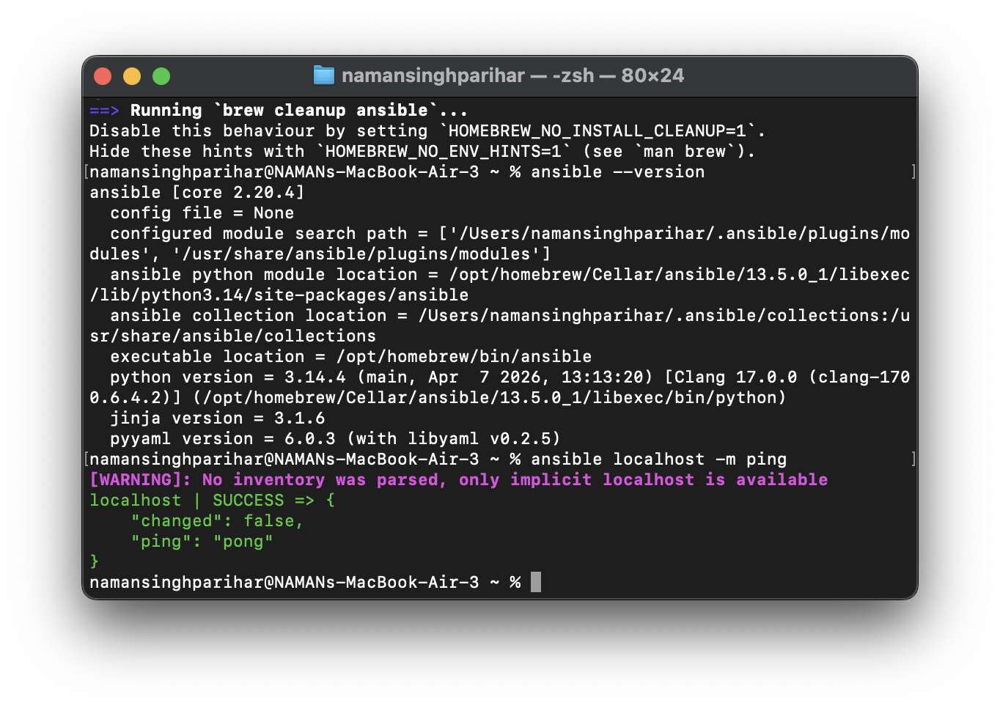

## Step 3: Create SSH Key Pair

An SSH key pair is used for secure authentication between systems.

- It consists of a **public key** and a **private key**  
- The public key is shared with the server  
- The private key remains secure on your system  
- Enables password-less and secure login  

### 📸 Illustration

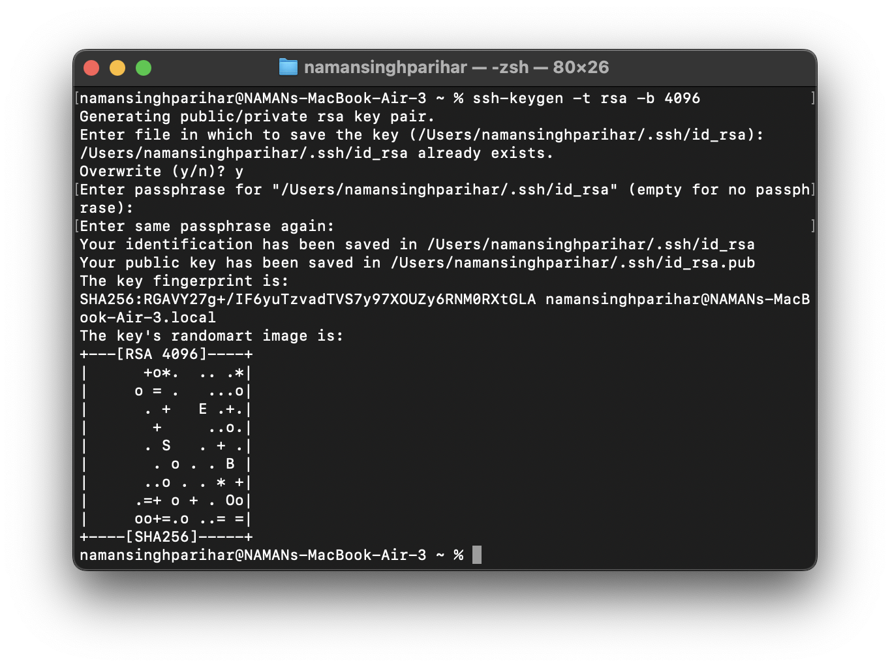

## Step 4: Create Dockerfile for Ubuntu SSH Server

A Dockerfile is used to define a custom image with an Ubuntu-based SSH server.

- Installs and configures SSH inside the container  
- Allows remote access to the container  
- Sets up required dependencies and configurations  
- Helps create a reusable and consistent environment  

### 📸 Illustration

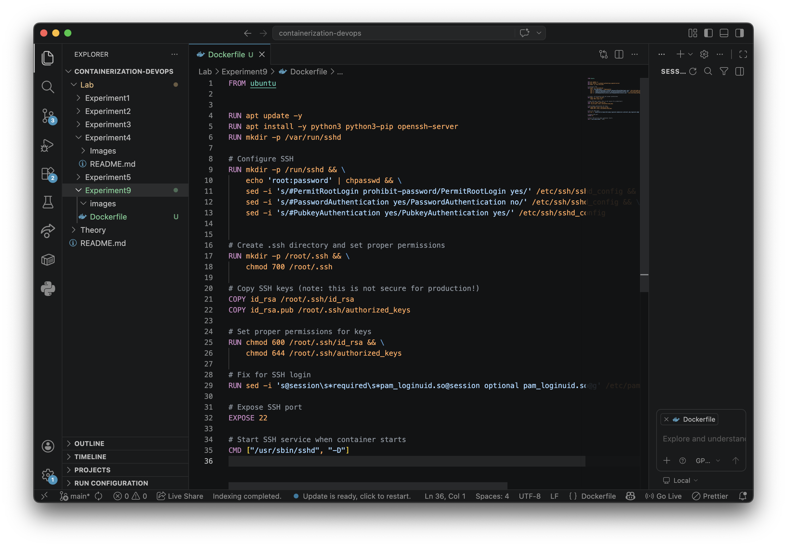

## Step 5: Build the Docker Image

Building a Docker image converts the Dockerfile into a runnable image.

- Packages all configurations and dependencies  
- Creates a reusable image for containers  
- Ensures consistency across environments  

### 📸 Illustration

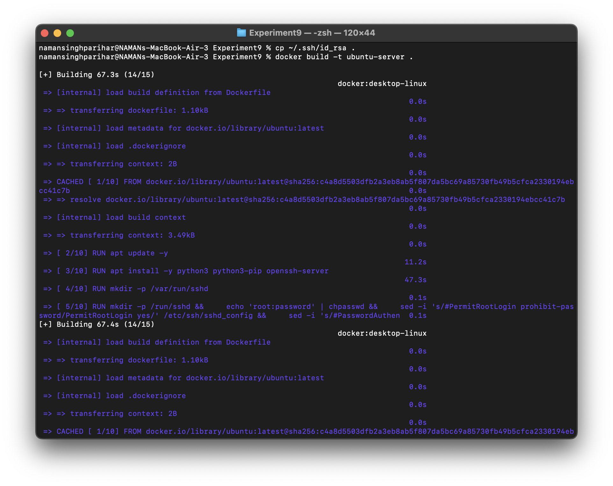

## Step 6: Run the Docker Container

Running a container starts an instance of the built Docker image.

- Launches the application inside an isolated environment  
- Allows interaction with the container (e.g., SSH access)  
- Can be configured with ports, volumes, and settings  

### 📸 Illustration

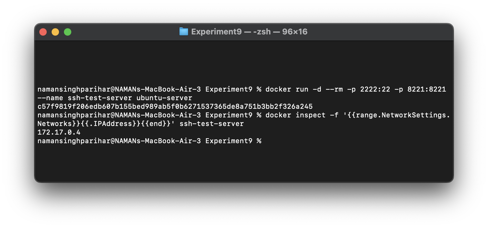

## Step 7: Test SSH Connections

### a) Test Password Authentication
- Verifies login using username and password  
- Ensures SSH service is working correctly  

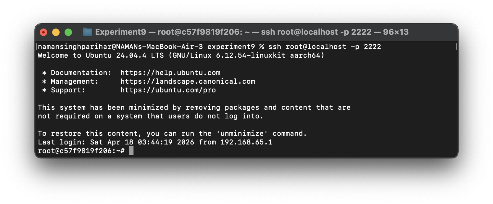

### b) Test Key-Based Authentication
- Verifies login using SSH key pair  
- More secure and preferred over passwords  

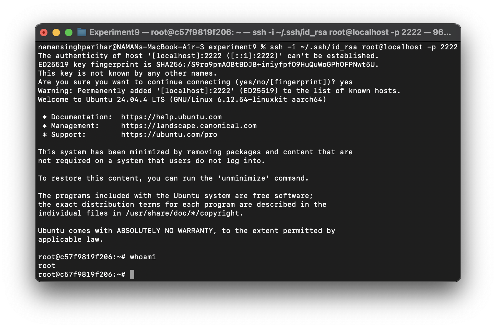

## Step 8: Start Multiple Containers (Ansible Targets)

Multiple containers are created to act as target servers for Ansible.

- Simulates a multi-server environment  
- Each container acts as a managed node  
- Useful for testing automation and configuration management  

### 📸 Illustration

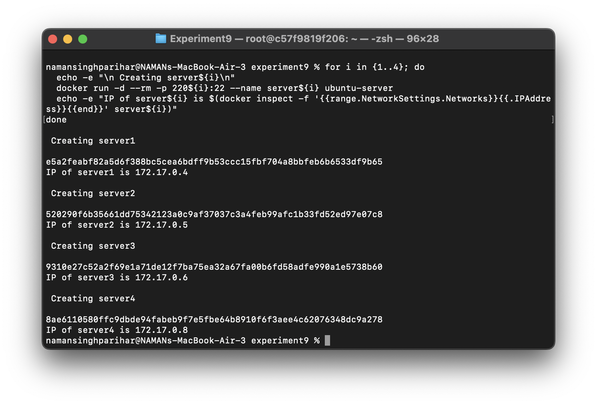

## Step 9: Create Ansible Inventory

An Ansible inventory defines the list of target servers to be managed.

- Contains IP addresses or hostnames of servers  
- Can group multiple servers together  
- Helps Ansible know where to execute tasks  

### 📸 Illustration

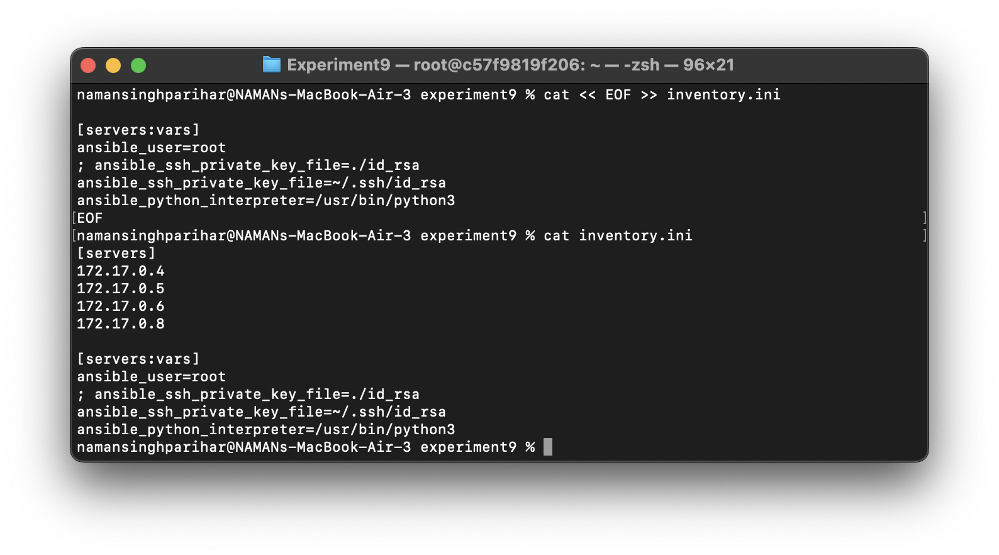

## Step 10: Test Connectivity

### a) SSH Test
- Verifies direct connection to target servers  
- Ensures SSH access is working properly  

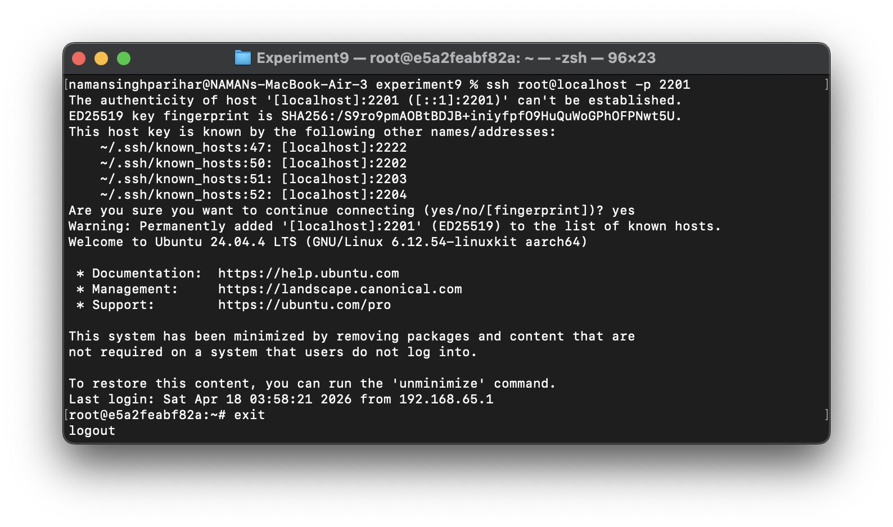

### b) Ansible Ping
- Checks connectivity using Ansible  
- Confirms that managed nodes are reachable  

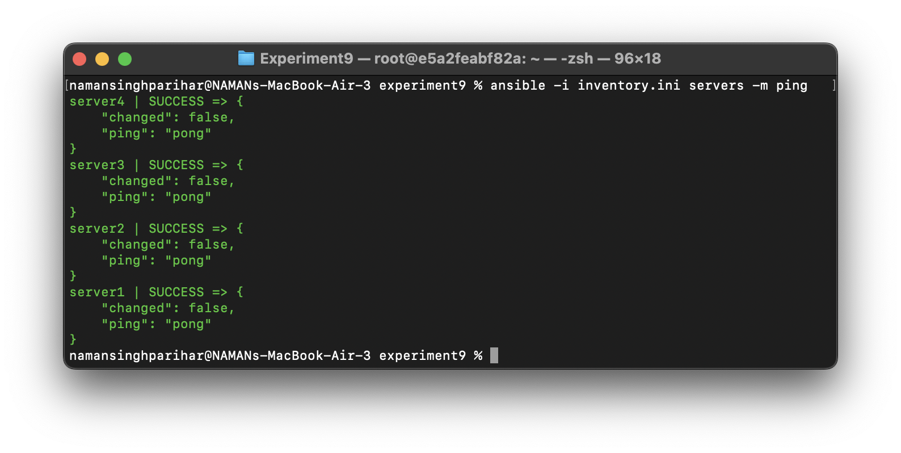

## Step 11: Create Playbook (update.yml)

An Ansible playbook is used to automate tasks on managed servers.

- Written in YAML format  
- Defines tasks to be executed on target nodes  
- Helps automate updates and configurations  

### 📸 Illustration

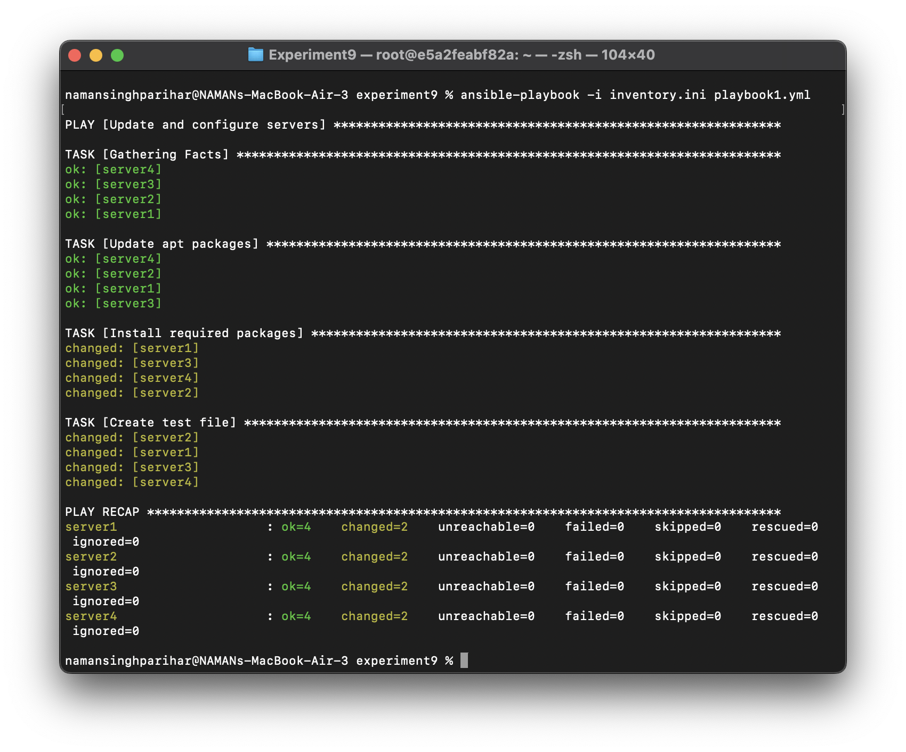

## Step 12: Verify Changes

### a) Manually via Docker
- Check containers directly to confirm updates  
- Ensures changes are applied correctly  

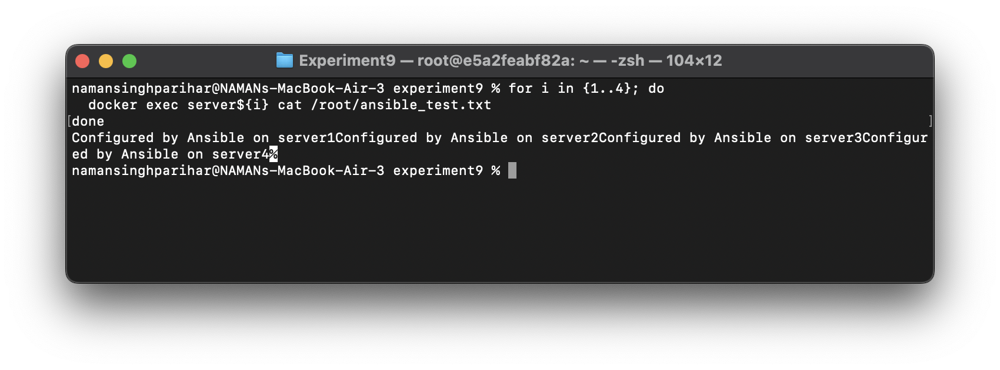

### b) Using Ansible
- Verify changes through automated tasks  
- Confirms successful execution across all nodes  

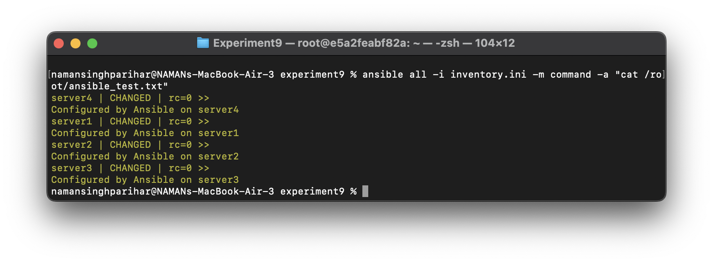

## Step 13: Clean Up (Remove Servers)

- Stop and remove containers after testing  
- Frees system resources  
- Keeps the environment clean and organized  

### 📸 Illustration

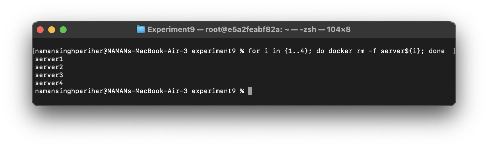
