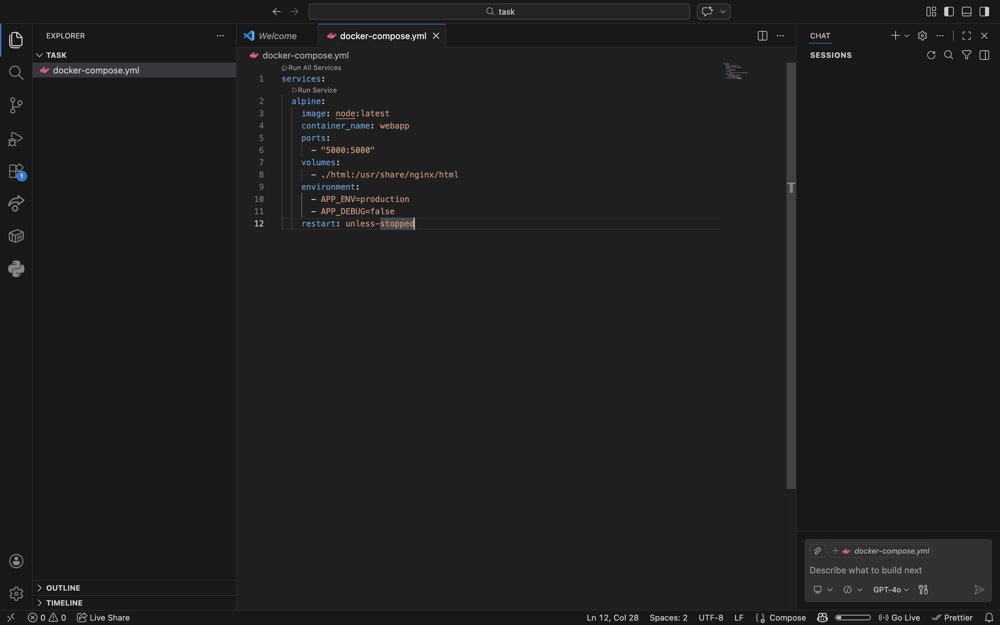
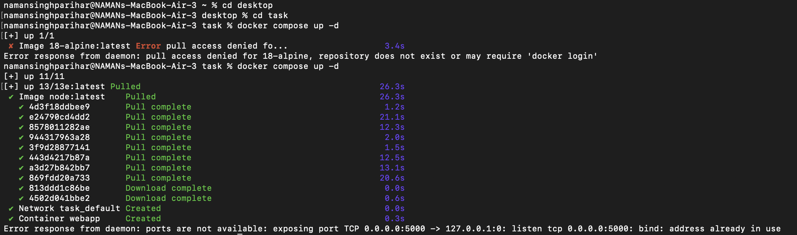
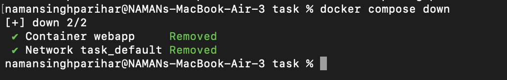

# Lab Task : 28-feb-2026

## Objective
- To write a compose file from a give run argument
- To run alpine image using docker compose

## Procedure

### Step 1: Write the "docker-compose.yml" file

### Step 2: Start Docker compose
Use command:

'''
docker compose up -d
'''

### Step 3: Terminate docker compose
Use command:

'''
docker compose down
'''

